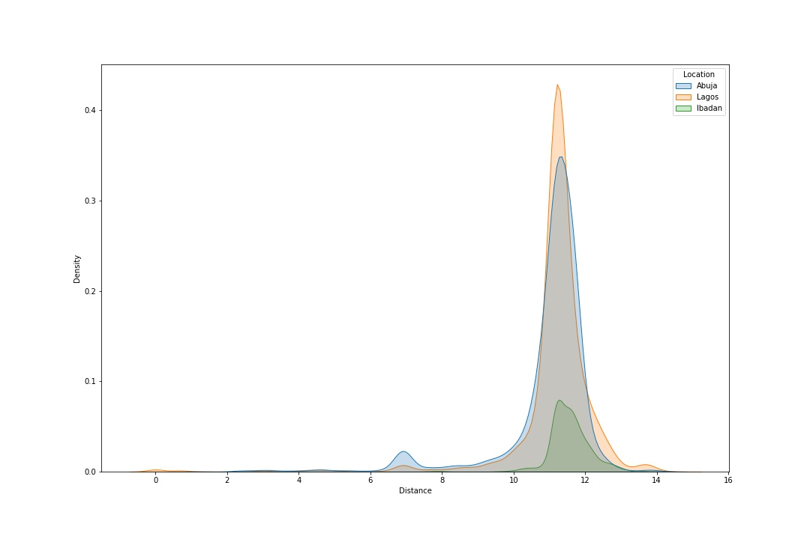
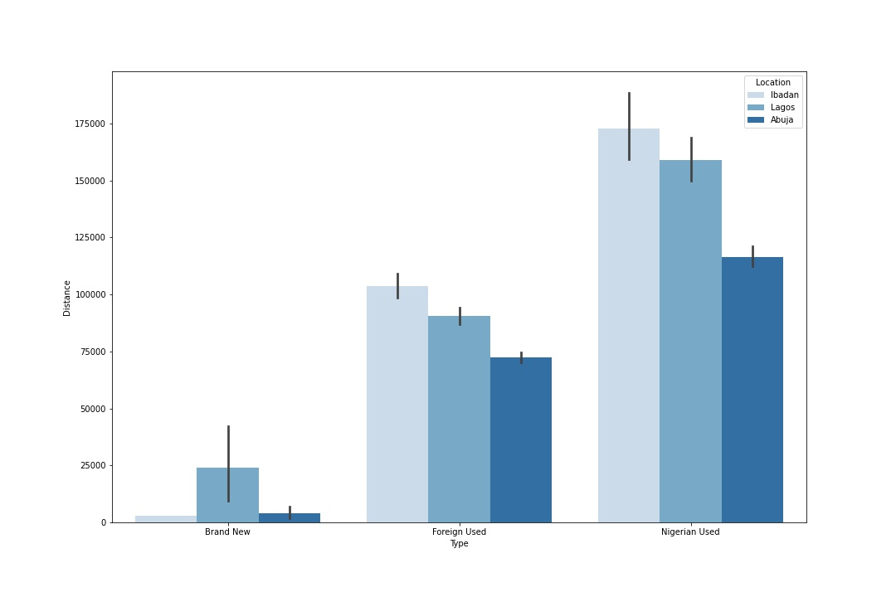
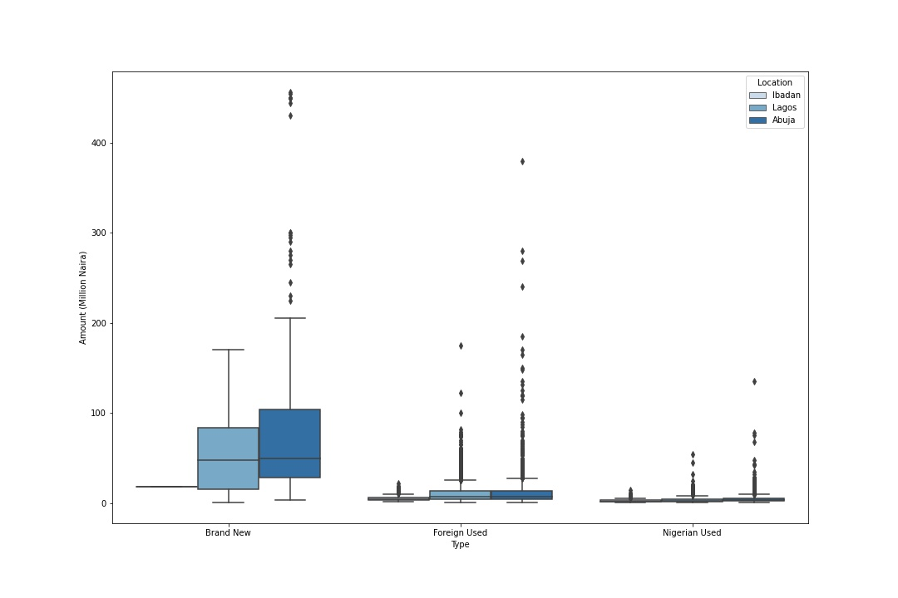
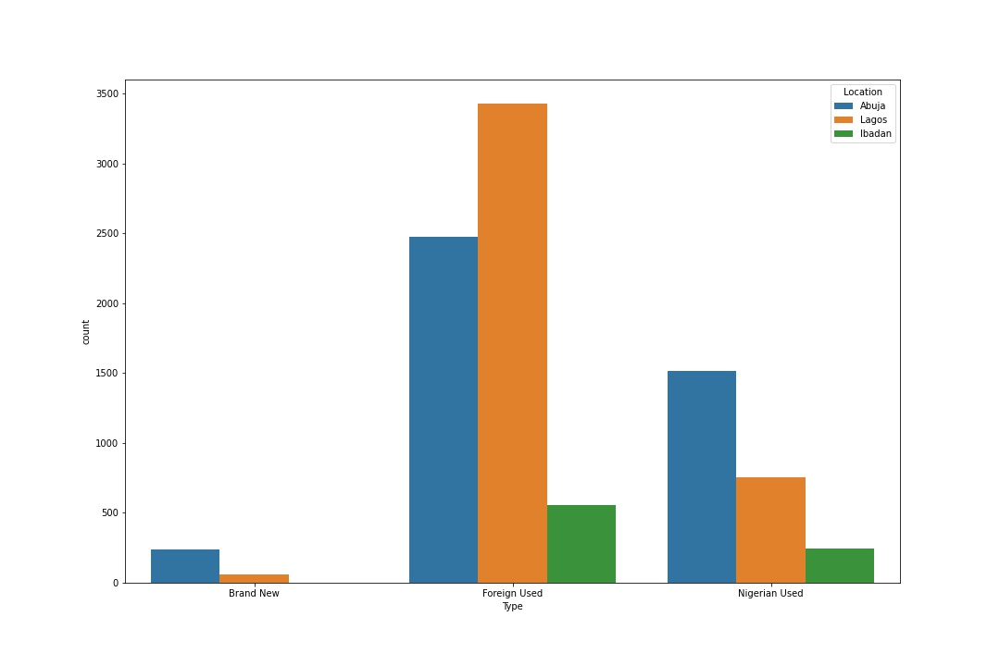
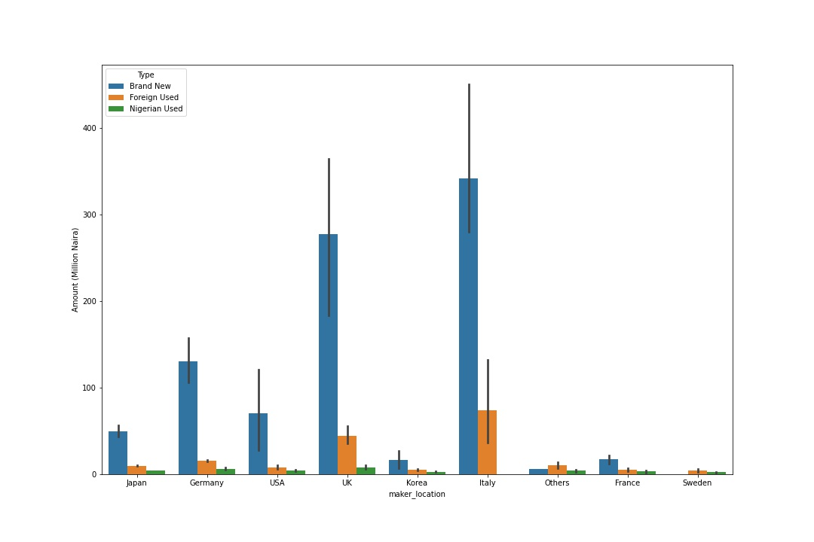
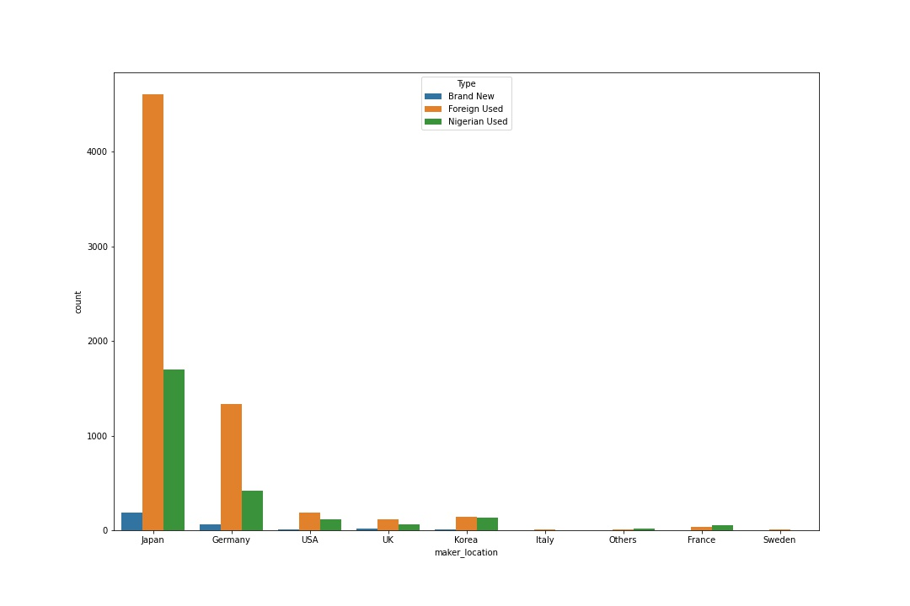

# Car Price Predicitions

This was for a competition, of which my model was ranked 10th out of 338 other models


## Description

A Nigerian automobile company, Great Motors, has just employed you as their lead data scientist for the analytics division.

Great Motors deals in used cars, with a huge market base in Nigeria. The company has a unique platform where customers can buy and sell cars. A seller posts details about the vehicle for review by the company’s mechanic on the platform to ascertain the vehicle's value. The company then lists the car for sale at the best price. Great Motors makes its profit by receiving a percentage of the selling price listed on the company platform. To ensure the car's selling price is the best for both the customer selling the vehicle and Great Motors, you have been assigned the task of coming up with a predictive model for determining the price of the car.

Your job is to predict the price the company should sell a car based on the available data the mechanics have submitted to you.

The objective of the challenge is to predict the `price (Amount (Million Naira)` the company should sell a car based on the available data (`Location, Maker, Model, Year, Colour, Amount (Million Naira), Type, Distance`). The objective is the predict the selling price.

## Understanding the Data

To predict the selling price we need to understand the dataset.

### Data Description

`VehicleID` - This is the unique identifier of the car.

`Location` - This is the location in Nigeria where the seller is based.

`Maker` - This is the manufacturer of the car. It is the brand name.

`Model` - This is the the name of the car product within a range of similar car products.

`Year` - This is the year the car was manufactured.

`Colour` - This is the colour of the car.

`Amount (Million Naira)` - This is the selling price of the car. It is the amount the company will sell the car.

`Type` - This is the nature of previous use of the car, whether it was previously used within Nigeria or outside Nigeria.

`Distance` - This is the mileage of the car. It is how much distance it covered in its previous use.

## Visualisation

### Distance Distribution


### Distance density across different locations



Here, we find that the cars in the different locations have about the same distance range.

### Distance on car classified by their types



Here we find that brand new cars generally lower distance travelled compared to other car type and Nigerian used cars have the most mileage.

### Price of each car type in each location



Cars bought brand new are far more expensive than other car types and cars bought in Abuja have a tendency of being more expensive regardless of type.

### Total Number of cars per type



Brand new cars are very little in this dataset, this could be an indicator that very few people buy or can afford a brand new car. Foreign used cars however leads in this case with lagos having the highest number of foreign used cars.

### Car prices by Maker Location and Type



Just as expected, we see that brand new cars are more expensive regardless of their location. Cars made in Italy are generally more expensive than other cars.

### Number of Cars per Maker Location and Type



Cars with makers from Japan enjoyed the highest foreign used patronage, followed by those from Germany.

## Modeling

Using a voting regressor consisting of svr, randomforestclassifier, decision tree and xgr, the model achieved a `RMSE` of `11.775`

```python
voting = VotingRegressor([
    ('svr', svr),
    ('rnd_forest', rnd_forest),
    ('dec_tree', dec_tree),
    ('xgr', xgr),
])
voting.fit(X_train_scaled, y_train)
```
